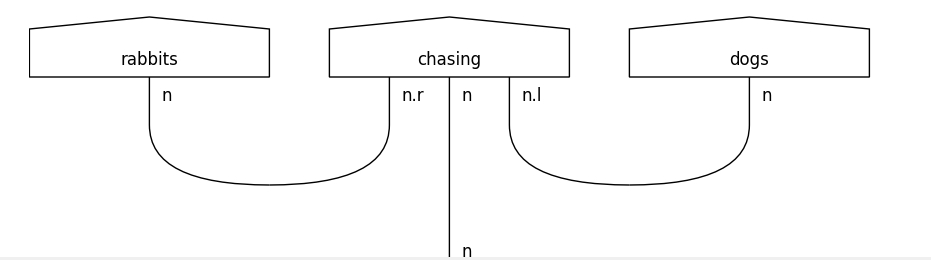
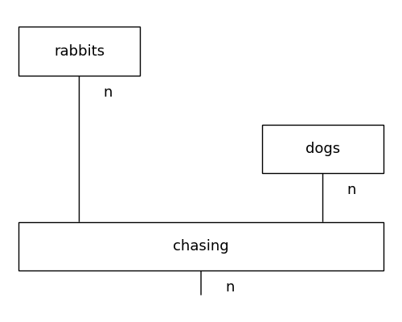
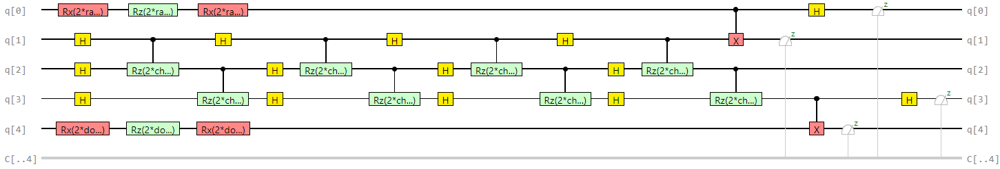

# Using Quantum NLP for Intelligent Understanding of Sentences

In this project, we use the quantum NLP library **Lambeq** to process sentences into quantum circuits, which can then be trained on a quantum computer for syntax-based understanding and specific NLP tasks (such as classification).

Model recorded **92.86% accuracy** after 200 epochs.


### How it works

1. Sentences are first transformed into string diagrams
   - The string diagrams have a syntax-based model, understanding the context of word ordering in the sentence (i.e. "Rabbits chase dogs" is interpreted differently from "Dogs chase rabbits".
3. The string diagram is rewritten and normalized to reduce computational overhead and training time.
4. The abstract string diagram is parametrized, transformed into a concrete quantum circuit (for quantum computers) or tensor network (for classical computers)
   - The quantum circuit can be visualized in multiple ways. We show 3 different circuit visualizations: DisCoPy, pytket, and tket.
5. By sending many sentences into this pipeline, we can train a model off the quantum circuits to perform specific NLP tasks, like classification. 

Each step of the process is visualized through the below diagrams. 


Raw string diagram.


Rewritten, normalized string diagram.


Tket quantum circuit (composed of Qubits)

### Installation

1. Install python and pip. 
2. Run the following commands to install required libraries:
   ```
   pip install lambeq 
   pip install ipython  # For data visualization
   pip install pytket-qiskit
   pip install pylatexenc
   pip install pytest  # For running tests
   ```
   
### Usage

- [quantum_user_input.py](app/src/main/quantum_user_input.py)
  - Send a sentence into the quantum pipeline, and view resulting string diagrams and quantum circuits.
- [classical_user_input.py](app/src/main/classical_user_input.py)
  - Send a sentence into the classical pipeline, and see the resulting string diagrams and tensor networks.
- [quantum_training.py](app/src/main/quantum_training.py)
  - Trains a model off quantum circuits, to classify sentences as containing an object-based or subject-based relative clause.

### Limitations

- Right now, the model is limited to single sentences with simple grammar. 

- For very long, complex sentences, a large number of qubits will be required for the quantum circuit representation. This can cause complications depending on the quantum machine's capability to process many qubits any once.

### Acknowledgements
- Research paper: https://arxiv.org/pdf/2110.04236.pdf
- Lambeq documentation: https://cqcl.github.io/lambeq/notebooks.html
