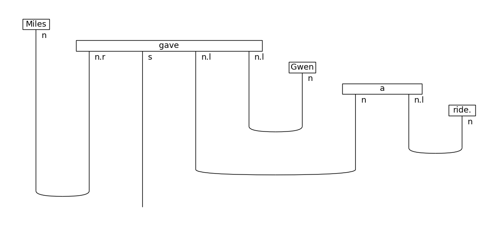

# Lambeq Usage Notes

- lambeq is a python library for quantum natural langauge processing (QNLP)
- It converts sentences into quantum circuits that are usable by quantum computers, or tensor networks that are usable by ML libraries like pytorch.

## Pipeline
- Pipeline:
    
    
    1. Input sentence goes through a parser, gets converted into a syntax tree.
    2. Syntax tree goes through an encoder, gets converted into a string diagram.
        
        
        
        - String diagram represents the grammatical structure of the string. All words that are related grammatically are connected in diagram.
        - Diagram is processed using DisCoPy Python library
    3. Rewrite rules are applied to the string diagram, to simplify or change it so that it can be converted to a quantum circuit.
    4. Rewritten string diagram is converted into a quantum circuit (to run on a quantum computer) or a tensor network (for classical computers)
    5. Output is sent to a quantum computer or simulator using a quantum compiler (circuit), or a ML library (tensor network)

## Rewritten String Diagram
s = start of parsing the sentence
n = noun or noun phrase i.e a table as well as any.
n.l or n.r = association of a noun is to the left or right depending on l or right

example Miles (n) gave (n.r)
Miles is a noun and gave is associated with that noun to the right.

full Miles gave 			gwen 	a 		ride
	 n 	  (n.r s n.l n.l)	(n)		(n n.l) (n)

